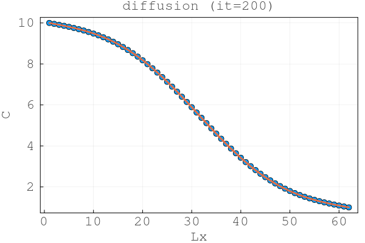
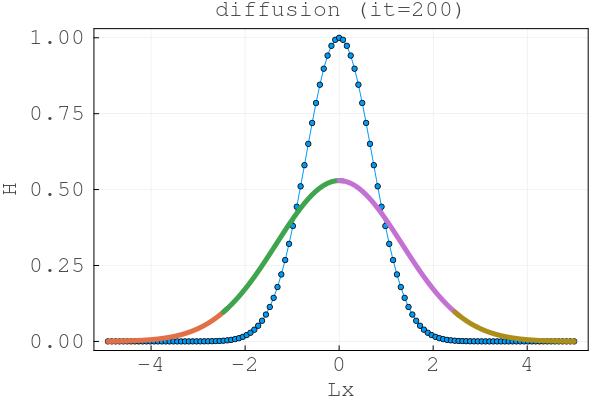
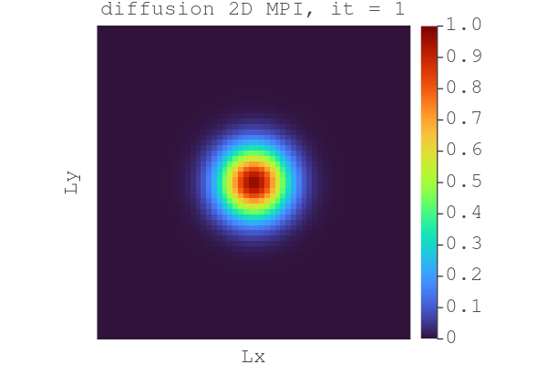
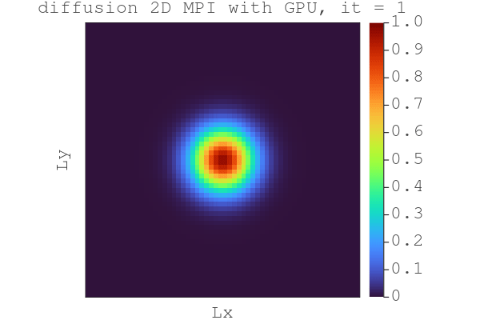
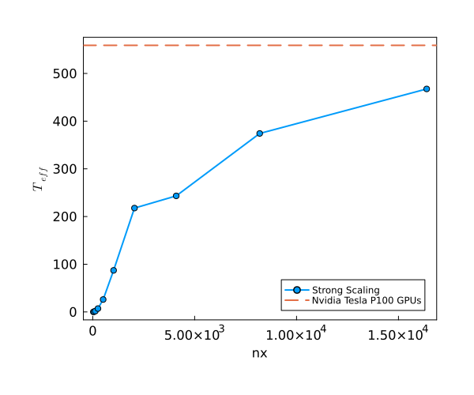
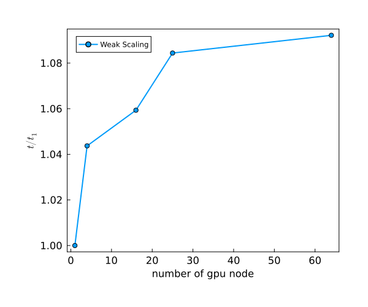
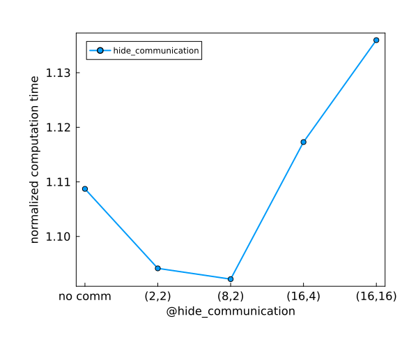

This project was developed with my fellow student Kam Lam Yeung. We decided to work together for this project and final project.

# Exercise 1
## Task 1


The figure above shows the 2-parallel-process diffusion. The result is as smooth as a a physical process that the computation is done through one process.



The figure above shows 4-parallel-process diffusion where the computation is parallelly done by 4 processes. The results is smooth.

## Task2


4 equal square subdomains are divided from the whole original domain for the parallel processes. The results assemble well that it is the same as the computation is done through once on the whole domain.

run the script using: ```~/.julia/bin/mpiexecjl -n 4 julia --project scripts/l8_diffusion_2D_mpi.jl```

## Task 3


4 GPU nodes are used in parallel to compute the diffussion process. Each node will be responsible for each subdomain. The results assemble well like the case in Task 2.

run in Piz Daint:

```
module load daint-gpu
module load Julia/1.9.3-CrayGNU-21.09-cuda

salloc -C'gpu' -Aclass04 -N4 -n4 --time=02:00:00

srun -n4 julia -O3 scripts/l8_diffusion_2D_mpi_gpu.jl
```

# Exercise 2
## Task 2
By running the script `compare_mat.jl` that computes the total sum of the element square difference between the `C_cpu` and `C_gpu`, it yields `-3.953270280061452e-16`. Therefore, difference between CPU and GPU implementation is negligible.

## Task 3
By running the script `compare_multixpu.jl`, the total sum of the element square difference between single GPU and multi-GPU results is `0.6843144355190445`. The difference shall also be negligible and the result is physical.

## Task 4


From the strong scaling results, we see that with the increasing domain size, `T_eff` increases accordingly. 

## Task 5


From the weak scaling results, as the number of gpu node (number of processes) icnreases, the relative computation time increaes. Perhaps some of the time is required to for the communication between the processes, resulting in the increase.

## Task 6


The results show that with the computing combination of the first and last 8 and 2 grid points in x and y dimension, yields the optimal computation. 