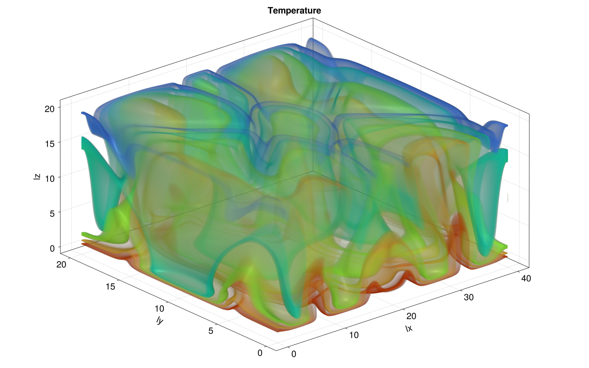

# Porous Convection

## Introduction
The exploration of convection behaviour of fluid in porous media gained interest over the last few decades, particularly for its crucil application in geophysics and energy-related engineering problems. Numerous studies were conducted to understand and model the behaviour through numerical simulations. However, because of the complex and non-linear characteristics of the flow regime, the computations prove to be highly demanding and resource-intensive.
The aim of this project was to implement an effective computation of the porous convection problem though parallel computing on multiple GPUs. This enabled to distribute the compuational workload among several GPU cores and allowed a faster computation.
## Theory
Porous convection is a convective fluid flow through a porous material and is caused by instabilities of fluid properties such as pressure or temperature. It can be described by partial differential equations composed of steady state and transient diffusion equations.

The fluid flow in porous media is described by Darcy's flux with the assumption of undeformable porous material and incompressible fluid. This reduces the conservation of mass in porous media to the following Darcy's flux equation:  

conservation of mass: $\nabla \cdot (\phi v) = 0$  

Darcy's flux: $q_D = \phi v$

With a further approximation of the linear dependency of Darcy's flux and pressure gradient, Darcy's law can be obtained:  

$q_D = -\frac{k}{\eta}(\nabla p - \rho g)$   

$k$    = Permeability  
$\eta$ = Fluid viscosity  
$p$    = Pressure  
$g$    = Gravitational force  

The heat convection is considered by observing the conservation of energy with the assumption of constant porosity:

$\rho c_p \frac{\delta T}{\delta t} + \rho c_p v \cdot \nabla T + \nabla \cdot q_F = 0 $   

Moreover, Fourier's law was introduced to describe the heat flow caused by temperature deviations: 

$q_F = -\lambda \nabla T  $   

$\lambda$ = Thermal conductivity
$T$       = Temperature

Integrating Fourier's law and Darcy's law into the conservation of mass, the following equation can be obtained: 

$\frac{\delta T}{\delta t} + \frac{1}{\phi} q_D \cdot \nabla T - \frac{\lambda}{\rho c_p} \nabla \cdot \nabla T = 0 $   

To model convection, it's necessary to take into account the dependency of the density of a fluid on its temperature. Assuming a linear dependency called the Boussinesq approach, the following equation was derived: 

$\rho = \rho_0[1 - \alpha (T-T_0)]$   

$q_D  = - \frac{k}{\eta}(\nabla p - \rho[1-\alpha(T-T_0)]g]$   

This dependency is considered in Darcy's flux as displayed in the equation above.

### Pseudo transient method
The pseudo transient method enables to effieciently solve steady-state and transient equations . By adding a pseudo transient term including a pseudo time, it allows the equation to converge to a steady-state at $t = \infty$. The pseudo time derivative term decreases to 0, as the change in time decreases when steady-state is approached. 

$\theta_D \frac{\delta q_D}{\delta \tau} + q_D = \frac{k}{\eta}(\nabla p - \rho[1-\alpha(T-T_0)]g]$  

$\theta_T \frac{\delta q_T}{\delta \tau} + q_T =  - \frac{\lambda}{\rho_0 c_p} \nabla T$   

$\beta \frac{\delta \rho}{\delta \tau} + \nabla q_D = 0$  

$\frac{\delta T}{\delta \tau} + \frac{T-T_old}{dt} + \frac{1}{\phi}q_D \cdot \nabla T + \nabla \cdot q_T = 0$  

$\theta_D, \theta_T$ = characteristic relaxiation time 
$\tau$               = pseudo time 
$\beta$              = pseudo compressibility 

### Parallel computing
The computation of the porous convection equation established in the section above requires a parallel computing environment on CPU and GPU simultaneously. The programming language Julia provides multiple advantages for such applications as it is considered simple, fast, and can be applied for prototyping and for production codes. An additional package called "ParallelStencil.jl" provides macros to facilitate the parallelization on GPU and CPU.

Parallel computing is a type of computation that refers to a process of dividing a problem into smaller, independent sections, which are executed simultaneously by multiple processors.
A problem can be optimized on one node by increasing the number of cores of the CPU or by overcoming GPU device memory limitations. However, if this is not sufficient, one can compute on multiple processors on multiple compute nodes. This requires efficient communication between the different processors and can be established by using a message-passing interface (MPI).
Parallelization can be obtained through strong scaling or weak scaling of the global problem. In this project, we focus on the weak scaling method. It defines the degree of parallelization by first estimating the optimal local problem size on a single GPU and then increasing the number of GPUs used until reaching the global problem size.

The MPI enables communication between different processors computing the assigned local problems. In addition, using ImplicitGlobalGrid.jl, distributed parallelization is rendered. Through the integration of ImplicitGlobalGrid.jl into ParallelStencil.jl, it allows having optimal parallel efficiency.
## Methods

The computation of the porous convection equation established in the section above requires a parallel computing environment on CPU and GPU simultaneously. The programming language Julia provides multiple advantages for such applications as it is considered simple, fast, and can be applied for prototyping and for production codes. An additional package called "ParallelStencil.jl" provides macros to facilitate the parallelization on GPU and CPU.

### 2D thermal porous convection
The thermal porous convection equation was discretized by using the Euler method with numerical parameters that can be obtained in the codes provided. 
The solution was established in 2D by using the submodule ParallelStencil.FiniteDifferences 2D and ImplicitGlobalGrid.jl, which enable a stencil-based xPU parallelization. At the same time, the performance of the computation was monitored by observing the memory throughput and error-checking with a predefined tolerance.

### 3D thermal porous convection
After obtaining a 2D solution for the equation, the code was adapted to compute the porous convection in three dimensions. As the calculation is resource-demanding, the computation was conducted on a virtual supercomputer hosting an Nvidia P100 16GB PCIe graphics card. The first 3D simulation was implemented by using one GPU.

### 3D thermal porous convection with MPI
To speed up the computation, it is necessary to distribute it on multiple GPUs. By using MPI.jl and ImplicitGlobal.jl, one is able to compute the partial differential equation in parallel on multiple GPUs and CPUs. The code has to be adapted to separate the local from the global computations with included macros.

### Testing

Unit tests and reference tests are included to monitor the correctness of the code and crucial functions during development. These tests are automated with Continuous Integration (CI) to run the test when pushing the code to Github.

## Results and Discussion
### 2D thermal porous convection

The porous convection implementation in 2D is visualized in the figure below. One can observe the constant boundary conditions and the convective movement of the fluid in between.  
The following numerical parameters were considered in these computations

| Parameter | Value |
| :-------: | :---: |
|    nx     | 1023  |
|    ny     |  511  |
|    nt     | 4000  |
|    ΔT     |  200  |

2D simulations are computationally easy to determine and do not require a high amount of resources compared to the 3D simulation. Through parallelization of the workload on multiple cores, the efficiency could be increased and enabled the code to run in a reasonable time. Although such simulations facilitate the complexity of the problem and display the concept, they are only reasonable in symmetrical systems, without significant spatial disturbances.

### 3D thermal porous convection

In the figure below, one can obtain a snapshot of the 3D simulation computed on a single GPU. The effect of the 3D interaction of the fluid can be observed. The cross-sectional flow regime is significantly different throughout an axis.

The described simulation is characterized by a significant computational intensity and requires additional resources despite the activation of multiple cores on a GPU. A 3D analysis of a problem can be crucial in some situations and entails an increasing demand. These computations can take multiple hours and are inconvenient to develop.
### 3D thermal porous convection with MPI
The figure below displays an animation of the 3D porous convection simulation using MPI to enable a multi xPU computation. Compared to the computation in the last section this simulation took approximately have the time to run.
The evolution of the flow characteristics can be observed. In the first few seconds, the flow seems to be symmetrical, but changes its characteristics drastically to a disturbed and heterogeneous convective flow. 

As described in the previous section, 3D simulations can be substantial and experience an increasing interest. By introducing multiple processors for the computation, the workload can be distributed among numerous GPUs and CPUs and enable a remarkable decrease in computation time. 

In general: parameter sensitivity, comparison with experimental data, or existing analytical solutions

## Conclusion

The MPI and ParallelStencil modules are meaningful tools to implement parallel computations and efficient use of multiple processors. Their performance was established in this report, and it was shown that the use of a supercomputer with several nodes proves to be significantly more efficient than conducting computations on only one node.

3D simulations are complex and require many resources to compute. For these applications, parallel computations on multiple xPUs are a common approach to solving the problem. However, this requires enough resources. In cases where 2D simulations are sufficient, one should consider using only one processor and activating multiple cores for parallel computations.

After developing a simulation code, it is necessary to conduct a sensitivity analysis considering crucial parameters. In this case, for example, the Rayleigh number could be investigated, as it determines the convective characteristic of the fluid.

For further increase in efficiency, the optimal local problem size for one GPU can be estimated, and afterward, the optimal number of GPUs to use can be determined.

